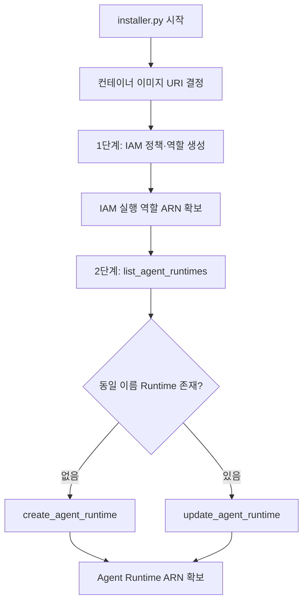
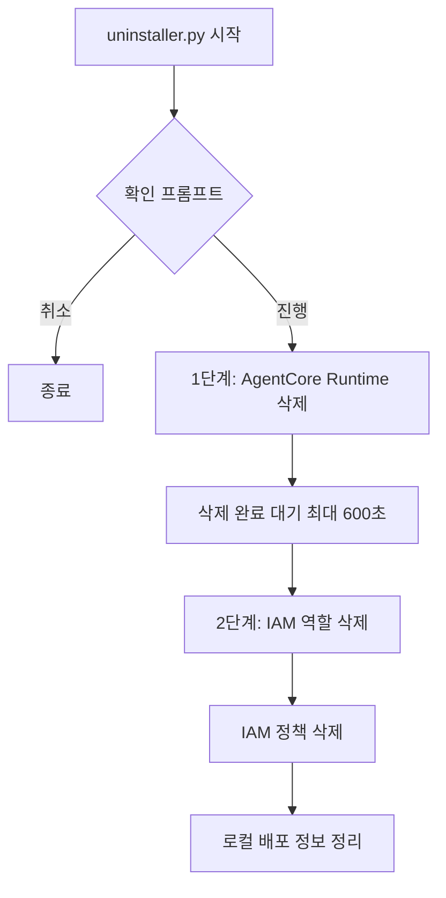

# Tavily MCP Server on AWS

[Tavily MCP Server](https://aws.amazon.com/marketplace/pp/prodview-twjga5bwmoszq)는 Model Context Protocol(MCP)을 통해 AI 에이전트에 실시간 웹 검색, 지능형 크롤링, 구조화된 데이터 추출 기능을 제공하는 프로덕션 준비 컨테이너 이미지입니다. Amazon Bedrock AgentCore에서 실행되며, Claude·Cursor·커스텀 LLM 에이전트 등 MCP 호환 클라이언트가 자연어 요청으로 Tavily 도구를 호출할 수 있습니다.

이 저장소는 Marketplace에서 제공하는 Tavily MCP 컨테이너를 Bedrock AgentCore Runtime에 배포하고, Streamlit 기반 에이전트 UI에서 `aws-tavily` MCP로 연동하는 예제를 포함합니다.

## 개요

Tavily MCP Server는 경량 MCP 서버로, 배포 후 클라이언트가 자연어 요청을 내면 실시간 검색·추출·크롤링 워크플로가 실행됩니다. 결과는 요약, 추출 데이터, 메타데이터 등 **구조화된 컨텍스트**로 반환되어 모델 추론 루프에 바로 주입할 수 있습니다.

| 항목 | 내용 |
|------|------|
| 판매자 | Tavily |
| 배포 방식 | Container image (Linux) |
| 유형 | MCP server |
| 지원 서비스 | [Amazon Bedrock AgentCore](https://aws.amazon.com/bedrock/agentcore/) |
| 배포 옵션 | Tavily MCP v0 |
| 최신 버전 | `tavily-mcp-v0.1.2` |
| 카테고리 | ML Solutions, Research, Generative AI |

## MCP 도구

Marketplace 제품 페이지에 정의된 주요 도구입니다.

| 도구 | 설명 |
|------|------|
| `tavily_search` | 자연어로 실시간 웹 검색. 관련도 순 결과, 구조화된 요약·URL 반환. 시간 범위·도메인·결과 수 등 필터 지원 |
| `tavily_extract` | 최대 20개 URL에서 본문 추출. 텍스트·마크다운 형태로 반환. 고급 모드는 동적 페이지·표 등 파싱 강화 |
| `tavily_crawl` | 시드 URL부터 사이트를 지능적으로 탐색·추출. 인증·접근 제약 처리 |
| `tavily_map` | 콘텐츠 로드 없이 접근 가능한 URL 목록 수집. 대량 추출·크롤 전 사이트맵 준비에 적합 |

도구 인자 상세는 [Tavily Search API 문서](https://docs.tavily.com/documentation/api-reference/endpoint/search)를 참고하세요.

## AWS Marketplace 구독

1. [Tavily MCP Server](https://aws.amazon.com/marketplace/pp/prodview-twjga5bwmoszq) 페이지에서 **View purchase options** 선택
2. 약관(EULA) 확인 후 구독
3. 대량·맞춤 계약이 필요하면 **Request private offer** 또는 **Request demo** 이용

유사 제품으로 [Tavily Enterprise](https://aws.amazon.com/marketplace)도 Marketplace에 등록되어 있습니다. 엔터프라이즈급 검색 API(SOC 2, SLA, Zero Data Retention)가 필요하면 Enterprise 제품을 검토하세요.

### 요금 안내

Marketplace 요금 페이지 기준:

- **제품 라이선스·사용량**: AWS Marketplace 외부에서 Tavily와 체결한 라이선스로 관리됩니다. 구독 시 Marketplace 밖에서 구매한 라이선스를 연결해 활성화합니다.
- **AWS 인프라**: Bedrock AgentCore Runtime 등 AWS 리소스 비용은 AWS 청구서에 포함됩니다. [AWS Pricing Calculator](https://calculator.aws/)로 인프라 비용을 추정할 수 있습니다.
- 구독은 종료일 없이 유지되며 언제든 취소할 수 있습니다(외부 라이선스 상태는 별도).

환불·지원: [support@tavily.com](mailto:support@tavily.com)

## 사전 준비

- [AWS CLI](https://docs.aws.amazon.com/cli/latest/userguide/getting-started-install.html) 최신 버전 설치 및 `aws configure` 완료
- Marketplace 구독 및 Bedrock AgentCore 사용 권한이 있는 AWS 계정

## Bedrock AgentCore 배포 (이 저장소)

Marketplace에서 제공하는 Tavily MCP 컨테이너 이미지를 Bedrock AgentCore Runtime에 올립니다. `installer.py`가 IAM 준비부터 Runtime 생성·갱신까지 수행하며, **로컬 Docker 빌드·푸시는 하지 않습니다.**

설치:

```bash
python installer.py
```

배포 절차·API 호출·생성되는 리소스는 [배포 상세](#배포-상세)를 참고하세요.

제거(`installer.py`로 만든 리소스 삭제):

```bash
python uninstaller.py
```

제거 절차는 [제거 상세](#제거-상세)를 참고하세요.

### 런타임 호출 예시

Agent Runtime ARN을 확보한 뒤 JSON-RPC로 도구를 호출할 수 있습니다.

도구 목록:

```json
{"jsonrpc": "2.0", "id": 1, "method": "tools/list"}
```

검색:

```json
{
  "jsonrpc": "2.0",
  "id": "1",
  "method": "tools/call",
  "params": {
    "name": "tavily_search",
    "arguments": {
      "query": "latest AI news",
      "max_results": 10
    }
  }
}
```

추출·크롤·맵:

```json
{"jsonrpc": "2.0", "id": "1", "method": "tools/call", "params": {"name": "tavily_extract", "arguments": {"urls": ["https://www.tavily.com"]}}}
```

```json
{"jsonrpc": "2.0", "id": "1", "method": "tools/call", "params": {"name": "tavily_crawl", "arguments": {"url": "https://www.tavily.com"}}}
```

```json
{"jsonrpc": "2.0", "id": "1", "method": "tools/call", "params": {"name": "tavily_map", "arguments": {"url": "https://www.tavily.com"}}}
```

## 배포 상세

`installer.py`는 Marketplace에 등록된 **사전 빌드 ECR 이미지 URI**를 지정하고, Bedrock AgentCore Control Plane API로 Runtime을 생성하거나 갱신합니다. 이미지 레이어를 로컬에서 받아 빌드하지 않으며, Runtime이 기동될 때 지정 URI의 컨테이너를 pull 합니다.

### 전체 흐름



### 컨테이너 이미지 지정

이미지 URI는 `installer.py`의 `get_container_image_uri()`로 결정합니다. 별도 지정이 없으면 Marketplace 기본 이미지를 사용합니다.

```text
709825985650.dkr.ecr.us-east-1.amazonaws.com/tavily/tavily-mcp:v0.1.2
```

다른 태그나 URI가 필요하면 `installer.py`의 `DEFAULT_CONTAINER_IMAGE_URI`를 변경한 뒤 스크립트를 다시 실행합니다.

### 1단계: IAM 정책·역할 (`create_iam_policies`)

Runtime이 ECR 이미지를 pull 하고 AgentCore·로그 등을 사용할 수 있도록 IAM을 준비합니다.

**관리형 정책** `AmazonBedrockAgentCoreRuntimePolicyFor{projectName}`

- `bedrock-agentcore:*`
- ECR: `GetAuthorizationToken`, `BatchGetImage`, `GetDownloadUrlForLayer` 등 (이미지 pull)
- CloudWatch Logs, X-Ray, Secrets Manager, Cognito, S3, Bedrock, EC2 등

정책이 이미 있으면 새 버전을 만들어 기본 버전으로 설정합니다(버전 5개 상한 시 구버전 삭제).

**실행 역할** `AmazonBedrockAgentCoreRuntimeRoleFor{projectName}`

- Trust Policy: `bedrock-agentcore.amazonaws.com`이 `sts:AssumeRole`
- 조건: `aws:SourceAccount` = 계정 ID, `aws:SourceArn` = `arn:aws:bedrock-agentcore:{region}:{accountId}:*`
- 위 정책을 역할에 연결

완료 후 Runtime에 연결할 **IAM 실행 역할 ARN**을 확보합니다.

### 2단계: AgentCore Runtime 생성·갱신 (`create_agent_runtime`)

**Runtime 이름**

`{projectName}_{현재_작업_디렉터리_이름}`에서 하이픈(`-`)을 언더스코어(`_`)로 바꿉니다.  
예: `projectName=agent-runtime`, 폴더 `aws-tavily` → `agent_runtime_aws_tavily`

**기존 Runtime 조회**

`bedrock-agentcore-control`의 `list_agent_runtimes`로 동일 `agentRuntimeName`이 있는지 확인합니다.

| 상황 | API | 동작 |
|------|-----|------|
| 없음 | `create_agent_runtime` | 신규 Runtime 생성 |
| 있음 | `update_agent_runtime` | 동일 ID로 이미지·역할·설정 갱신 |

**공통 Runtime 설정**

`create_agent_runtime` / `update_agent_runtime`에 전달되는 주요 값:

| 항목 | 값 |
|------|-----|
| `agentRuntimeArtifact.containerConfiguration.containerUri` | 위에서 결정한 ECR 이미지 URI |
| `roleArn` | 1단계에서 생성한 IAM 실행 역할 ARN |
| `networkConfiguration.networkMode` | `PUBLIC` |
| `protocolConfiguration.serverProtocol` | `MCP` |

AgentCore가 지정 URI의 컨테이너를 pull 한 뒤 MCP 서버로 기동합니다. Marketplace 구독 경로에서는 별도 API 키 환경 변수를 넣지 않습니다.

**IAM 전파 대기**

역할을 막 생성·갱신한 직후 `Role validation failed` / `cannot be assumed`가 나올 수 있어, 최대 4회 지수 백오프(5초~15초)로 재시도합니다.

**완료 후**

성공 시 **Agent Runtime ARN**이 반환됩니다. Streamlit·LangGraph 클라이언트는 이 ARN으로 AgentCore MCP 엔드포인트에 SigV4 연결합니다.

### 실행 예시 출력

```text
============================================================
AgentCore Runtime Installation Script
============================================================
Configuration file loaded successfully
  - Project Name: agent-runtime
  - Region: us-east-1
  - Account ID: 123456789012
  - Container Image: 709825985650.dkr.ecr.us-east-1.amazonaws.com/tavily/tavily-mcp:v0.1.2

============================================================
Creating IAM policies and roles
============================================================
...
Created AgentCore Runtime Role ARN: arn:aws:iam::123456789012:role/AmazonBedrockAgentCoreRuntimeRoleForagent-runtime
Created AgentCore Runtime ARN: arn:aws:bedrock-agentcore:us-east-1:123456789012:runtime/...
```

### 사전 조건·주의

- Marketplace에서 Tavily MCP Server를 구독한 계정이어야 ECR 이미지 pull 권한이 정상 동작합니다.
- `installer.py` 실행 계정에는 IAM 생성·`bedrock-agentcore-control` API 호출 권한이 필요합니다.
- 이미지 태그를 바꿀 때는 `installer.py`의 기본 URI를 수정한 뒤 `python installer.py`를 다시 실행하면 기존 Runtime이 **update** 됩니다.

## 제거 상세

`uninstaller.py`는 `installer.py`가 생성한 AWS 리소스를 **역순**으로 삭제합니다. Marketplace ECR 이미지는 삭제하지 않으며, **AWS Marketplace 구독도 해지하지 않습니다.**

### 전체 흐름



### 실행 방법

```bash
# 확인 프롬프트 후 삭제
python uninstaller.py

# 확인 없이 삭제
python uninstaller.py --yes
```

기본 실행 시 삭제 대상(Runtime, IAM 역할·정책)을 출력한 뒤 `yes` 입력 시에만 진행합니다. `--yes`는 프롬프트를 건너뜁니다.

`installer.py`와 **동일한 프로젝트 디렉터리**에서 실행해야 Runtime 이름 규칙(`{projectName}_{폴더명}`)이 일치합니다.

### 1단계: AgentCore Runtime 삭제 (`delete_agent_runtime`)

**대상 식별**

1. 저장된 Agent Runtime ARN이 있으면 해당 ID로 `delete_agent_runtime` 호출
2. 없으면 `list_agent_runtimes`로 `installer.py`와 같은 이름의 Runtime을 검색 후 삭제

이미 삭제된 경우 `ResourceNotFoundException`은 성공으로 처리합니다.

**삭제 완료 대기**

`delete_agent_runtime` 요청 후 최대 **600초** 동안 10초 간격으로 `list_agent_runtimes`를 조회합니다. 목록에 Runtime이 없어지면 1단계를 완료합니다. 시간 초과 시 수동 확인이 필요합니다.

### 2단계: IAM 역할·정책 삭제 (`delete_iam_resources`)

`installer.py`가 만든 이름 규칙으로 리소스를 찾아 삭제합니다.

**IAM 역할** `AmazonBedrockAgentCoreRuntimeRoleFor{projectName}`

- 역할에 연결된 관리형 정책 detach
- 인라인 정책이 있으면 삭제
- `delete_role`로 역할 삭제

**IAM 정책** `AmazonBedrockAgentCoreRuntimePolicyFor{projectName}`

- 기본이 아닌 정책 버전을 먼저 삭제
- `delete_policy`로 정책 삭제

역할·정책이 이미 없으면 `NoSuchEntity`로 간주하고 다음 단계로 진행합니다.

한 단계에서 오류가 나도 **나머지 단계는 계속 실행**하며, 종료 코드 1로 경고를 표시할 수 있습니다.

### 마무리

모든 단계 후 `installer.py`가 기록한 배포 관련 항목(Runtime ARN, 역할 ARN, 컨테이너 URI 등)을 로컬에서 제거합니다.

### 삭제되지 않는 항목

| 항목 | 이유 |
|------|------|
| Marketplace ECR 이미지 | Tavily 소유의 사전 빌드 이미지, installer가 생성하지 않음 |
| AWS Marketplace 구독 | 별도 AWS Console에서 해지 |
| CloudWatch Logs 로그 그룹 | Runtime 삭제 후에도 보존될 수 있음(필요 시 Console에서 정리) |

### 실행 예시 출력

```text
============================================================
AgentCore Runtime Uninstallation Script
============================================================
WARNING: This will delete resources created by installer.py:
  - Bedrock AgentCore runtime
  - IAM role (AmazonBedrockAgentCoreRuntimeRoleFor*)
  - IAM policy (AmazonBedrockAgentCoreRuntimePolicyFor*)
============================================================

✓ Agent runtime deletion requested: arn:aws:bedrock-agentcore:...
✓ AgentCore runtime 'agent_runtime_aws_tavily' has been successfully deleted

✓ IAM role deleted: arn:aws:iam::123456789012:role/AmazonBedrockAgentCoreRuntimeRoleForagent-runtime
✓ IAM policy deleted: arn:aws:iam::123456789012:policy/AmazonBedrockAgentCoreRuntimePolicyForagent-runtime

Uninstallation process completed successfully!
```

### 사전 조건·주의

- `installer.py`로 배포한 적이 있는 계정·리전에서 실행합니다.
- 실행 계정에 `bedrock-agentcore-control` 삭제 API 및 IAM 역할·정책 삭제 권한이 필요합니다.
- Runtime 삭제가 진행 중이면 IAM 삭제가 실패할 수 있습니다. 1단계 완료 대기 후 2단계가 실행됩니다.
- 다른 프로젝트가 동일 IAM 역할 이름을 공유하지 않는지 확인한 뒤 제거하세요.

## 애플리케이션 연동

`application/` 디렉터리의 Streamlit 앱은 Agent 모드에서 `aws-tavily` MCP 타입을 선택하면, 배포된 AgentCore Runtime에 SigV4 인증으로 연결합니다 (`application/mcp_config.py`). LangGraph 에이전트는 Tavily 도구 인자(예: `country` ISO 코드)를 사전에 정규화합니다 (`application/tavily_tool_interceptor.py`).

## AWS 통합 과금·운영 팁

- **AWS 인프라 비용**: AgentCore·로그·네트워크 등은 AWS Cost Explorer에서 추적
- **조직 통합 청구**: AWS Organizations Consolidated Billing으로 여러 계정 비용을 마스터 계정 청구서로 통합
- **태그**: Cost Allocation Tags로 프로젝트·부서별 배분
- **한국 법인**: AWS Korea를 통한 원화 결제·세금계산서 등은 AWS 계정 청구 정책에 따름

제품 라이선스·사용량은 Marketplace 구독 및 판매자(EULA) 조건에 따릅니다.

## 참고 링크

- [Tavily MCP Server (AWS Marketplace)](https://aws.amazon.com/marketplace/pp/prodview-twjga5bwmoszq)
- [Tavily API 문서](https://docs.tavily.com/)
- [Amazon Bedrock AgentCore](https://aws.amazon.com/bedrock/agentcore/)
- [AWS CLI 설치 가이드](https://docs.aws.amazon.com/cli/latest/userguide/getting-started-install.html)
- [AWS Pricing Calculator](https://calculator.aws/)
