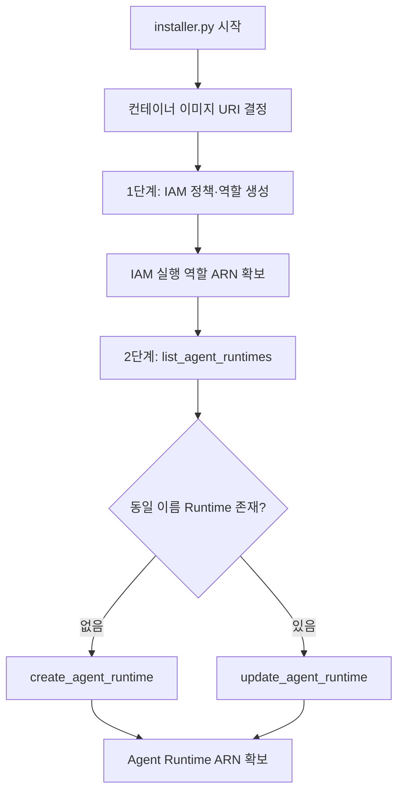

# Tavily MCP Server on AWS

[Tavily MCP Server](https://aws.amazon.com/marketplace/pp/prodview-twjga5bwmoszq)는 Model Context Protocol(MCP)을 통해 AI 에이전트에 실시간 웹 검색, 지능형 크롤링, 구조화된 데이터 추출 기능을 제공하는 프로덕션 준비 컨테이너 이미지입니다. Amazon Bedrock AgentCore에서 실행되며, Claude·Cursor·커스텀 LLM 에이전트 등 MCP 호환 클라이언트가 자연어 요청으로 Tavily 도구를 호출할 수 있습니다. 이 저장소는 Marketplace에서 제공하는 Tavily MCP 컨테이너를 Bedrock AgentCore Runtime에 배포하고, Streamlit 기반 에이전트 UI에서 `aws-tavily` MCP로 연동하는 예제를 포함합니다.

## 개요

Tavily MCP Server는 경량 MCP 서버로, 배포 후 클라이언트가 자연어 요청을 내면 실시간 검색·추출·크롤링 워크플로가 실행됩니다. 결과는 요약, 추출 데이터, 메타데이터 등 **구조화된 컨텍스트**로 반환되어 모델 추론 루프에 바로 주입할 수 있습니다.

### MCP 도구

MCP로 제공되는 도구는 아래와 같습니다.

| 도구 | 설명 |
|------|------|
| `tavily_search` | 자연어로 실시간 웹 검색. 관련도 순 결과, 구조화된 요약·URL 반환. 시간 범위·도메인·결과 수 등 필터 지원 |
| `tavily_extract` | 최대 20개 URL에서 본문 추출. 텍스트·마크다운 형태로 반환. 고급 모드는 동적 페이지·표 등 파싱 강화 |
| `tavily_crawl` | 시드 URL부터 사이트를 지능적으로 탐색·추출. 인증·접근 제약 처리 |
| `tavily_map` | 콘텐츠 로드 없이 접근 가능한 URL 목록 수집. 대량 추출·크롤 전 사이트맵 준비에 적합 |

도구 인자 상세는 [Tavily Search API 문서](https://docs.tavily.com/documentation/api-reference/endpoint/search)를 참고하세요.

### AWS Marketplace 구독 방법

1. [Tavily MCP Server](https://aws.amazon.com/marketplace/pp/prodview-twjga5bwmoszq) 페이지에서 **View purchase options** 선택
2. 약관(EULA) 확인 후 구독
3. 대량·맞춤 계약이 필요하면 **Request private offer** 또는 **Request demo** 이용

유사 제품으로 [Tavily Enterprise](https://aws.amazon.com/marketplace)도 Marketplace에 등록되어 있습니다. 

### 요금 안내

Marketplace 요금 페이지 기준은 아래와 같습니다.

- **제품 라이선스·사용량**: AWS Marketplace 외부에서 Tavily와 체결한 라이선스로 관리됩니다. 구독 시 Marketplace 밖에서 구매한 라이선스를 연결해 활성화합니다.
- **AWS 인프라**: Bedrock AgentCore Runtime 등 AWS 리소스 비용은 AWS 청구서에 포함됩니다. [AWS Pricing Calculator](https://calculator.aws/)로 인프라 비용을 추정할 수 있습니다.
- 구독은 종료일 없이 유지되며 언제든 취소할 수 있습니다(외부 라이선스 상태는 별도).

| 제품 | 비용 | 특이사항 |
|------|------|----------|
| **Tavily MCP Server** | Marketplace 등록 비용 없음 | API Key + AWS 인프라 비용 별도 |
| **Tavily Enterprise** | **$49,000 / 년** | 90일 무료 체험 제공 |

## 배포

### 사전 준비

- [AWS CLI](https://docs.aws.amazon.com/cli/latest/userguide/getting-started-install.html) 설치하고 `aws configure`로 credential이 설정되어야 합니다.
- 계정은 Bedrock AgentCore 사용 권한이 있어야 합니다.
- Marketplace에서 Tavily MCP Server를 구독합니다.

### 설치 방법

여기에서는 marketplace에서 제공하는 Tavily MCP 컨테이너 이미지를 Bedrock AgentCore Runtime에 올립니다. 먼저 관련 코드를 다운로드합니다.

```bash
git clone https://github.com/kyopark2014/aws-tavily
```

`installer.py`로 설치합니다. 이때 IAM 권한부터 Runtime 생성·갱신을 수행합니다.

```bash
cd aws-tavily && python installer.py
```


### 배포 흐름

`installer.py`는 Marketplace에 등록된 **사전 빌드 ECR 이미지 URI**를 지정하고, Bedrock AgentCore Control Plane API로 Runtime을 생성하거나 갱신합니다. 이미지 레이어를 로컬에서 받아 빌드하지 않으며, Runtime이 기동될 때 지정 URI의 컨테이너를 pull 합니다. Runtime 이름은 `agent_runtime_aws_tavily`, 리전은 `us-east-1`로 고정되어 있어 다른 프로젝트에서 이미 배포한 Runtime을 재활용할 수 있습니다.



### 컨테이너 이미지

배포시 활용하는 이미지 URI는 아래와 같습니다. [installer.py](./installer.py)에서 설정하고 있습니다.

```text
709825985650.dkr.ecr.us-east-1.amazonaws.com/tavily/tavily-mcp:v0.1.2
```


### Tavily MCP 삭제

더이상 사용하지 않는 경우에 아래와 같에 삭제할 수 있습니다.

```bash
python uninstaller.py
```

`uninstaller.py`는 `installer.py`가 생성한 AWS 리소스를 **역순**으로 삭제합니다. Marketplace ECR 이미지는 삭제하지 않으며, **AWS Marketplace 구독도 해지하지 않습니다.** `uninstaller.py`로 삭제되지 않는 항목은 아래와 같습니다.

| 항목 | 이유 |
|------|------|
| Marketplace ECR 이미지 | Tavily 소유의 사전 빌드 이미지, installer가 생성하지 않음 |
| AWS Marketplace 구독 | 별도 AWS Console에서 해지 |
| CloudWatch Logs 로그 그룹 | Runtime 삭제 후에도 보존될 수 있음(필요 시 Console에서 정리) |


## 애플리케이션의 활용

`application/` 디렉터리의 Streamlit 앱은 Agent 모드에서 `aws-tavily` MCP 타입을 선택하면, `us-east-1`에 배포된 `agent_runtime_aws_tavily` Runtime에 SigV4 인증으로 연결합니다. [mcp_config.py](./application/mcp_config.py)에서는 고정 Runtime 이름으로 ARN을 조회한 뒤 아래와 같이 Tavily MCP용 `mcp.json`을 구성합니다. [langgraph_agent.py](./application/langgraph_agent.py)는 `auth_type`이 `aws_sigv4`인 경우 [agentcore_sigv4_auth.py](./application/agentcore_sigv4_auth.py)의 `AgentCoreSigV4Auth`로 요청에 IAM 서명을 적용합니다.

```python
AWS_TAVILY_RUNTIME_NAME = "agent_runtime_aws_tavily"
AWS_TAVILY_RUNTIME_REGION = "us-east-1"

agent_arn = get_agent_runtime_arn("aws-tavily")
encoded_arn = agent_arn.replace(":", "%3A").replace("/", "%2F")
mcp_url = (
    f"https://bedrock-agentcore.{AWS_TAVILY_RUNTIME_REGION}.amazonaws.com/runtimes/"
    f"{encoded_arn}/invocations?qualifier=DEFAULT"
)

{
    "mcpServers": {
        "tavily-search": {
            "type": "streamable_http",
            "url": mcp_url,
            "auth_type": "aws_sigv4",
            "auth_region": AWS_TAVILY_RUNTIME_REGION,
            "auth_service": "bedrock-agentcore",
        }
    }
}
```


## AWS 통합 과금·운영 팁

- **AWS 인프라 비용**: AgentCore·로그·네트워크 등은 AWS Cost Explorer에서 추적
- **조직 통합 청구**: AWS Organizations Consolidated Billing으로 여러 계정 비용을 마스터 계정 청구서로 통합
- **태그**: Cost Allocation Tags로 프로젝트·부서별 배분
- **한국 법인**: AWS Korea를 통한 원화 결제·세금계산서 등은 AWS 계정 청구 정책에 따름

제품 라이선스·사용량은 Marketplace 구독 및 판매자(EULA) 조건에 따릅니다.


## 실행 결과

아래와 같이 streamlit을 실행합니다.

```bash
streamlit run application/app.py
```

아래와 같이 aws-tavily가 선택되어 있습니다.


이후 아래와 같이 "강남역 맛집?"을 검색하면, tavily_search를 통해 검색을 수행합니다.


아래와 같은 응답을 얻을 수 있습니다.


## 참고 링크

- [Tavily MCP Server (AWS Marketplace)](https://aws.amazon.com/marketplace/pp/prodview-twjga5bwmoszq)
- [Tavily API 문서](https://docs.tavily.com/)
- [Amazon Bedrock AgentCore](https://aws.amazon.com/bedrock/agentcore/)
- [AWS CLI 설치 가이드](https://docs.aws.amazon.com/cli/latest/userguide/getting-started-install.html)
- [AWS Pricing Calculator](https://calculator.aws/)
